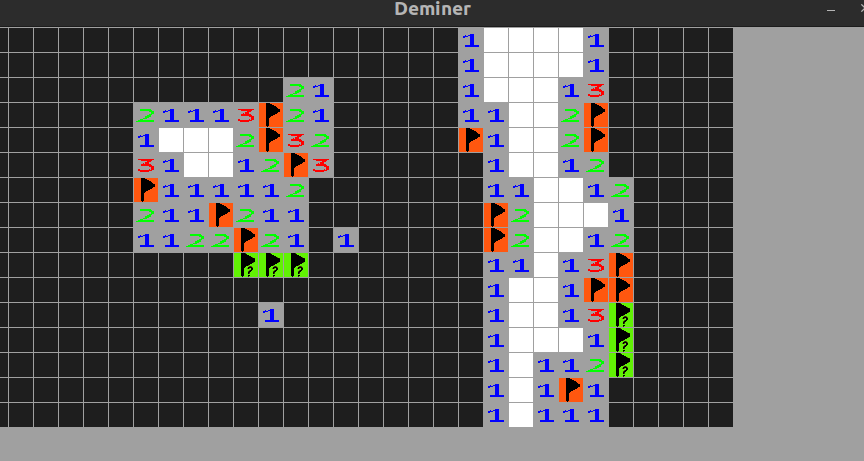

# Deminer

PHP clone of classic game Minesweeper written with php-sdl2 package upon SDL2 library.

Steps to run:
- Install SDL2 library (`libSDL2, libSDL2_image, libSDL2_mixer, libSDL2_ttf`)
- `composer install`
- `php src/main.php`